<div align="center">
  

# 動物數數 — Animal Counting

> 專為 **1–6 歲小朋友** 設計的數數遊戲！
> A fun counting game for kids aged 1–6!
> 1〜6歳のこどものためのかずあそびゲーム！

**版本 Version：v1.0.3** ｜ 授權 License：MIT ｜ 平台 Platform：Android (API 31+)

</div>

---

## 🎮 這是什麼遊戲？ What is this?

畫面上會出現一群可愛的動物 🐶🐱🐰🐻🐼🐷🐮🐸🐵🦁，
小朋友只要**數一數**有幾隻，再按下正確的數字，就能得分！
答題時還會唸出數字和結果的聲音，讓小朋友邊聽邊學！

Cute animals appear on screen. Kids **count** them and tap the right number to score points!
The app reads out the number and result with voice, so children learn while they play!

---

## 📱 遊戲畫面 Screenshots

### 🌍 選擇語言 Select Language
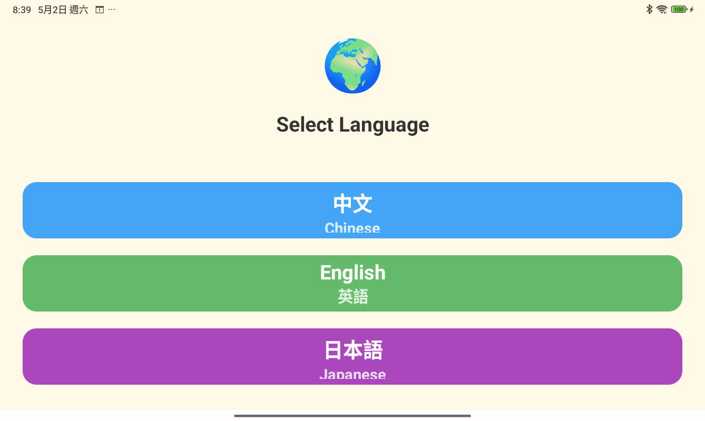

第一次開啟 App，選擇你想用的語言：**中文、English、日本語**
支援語音朗讀，讓小朋友可以用自己熟悉的語言學數數！

---

### 🏠 主畫面 Home Screen

| 中文 | English | 日本語 |
|------|---------|--------|
| 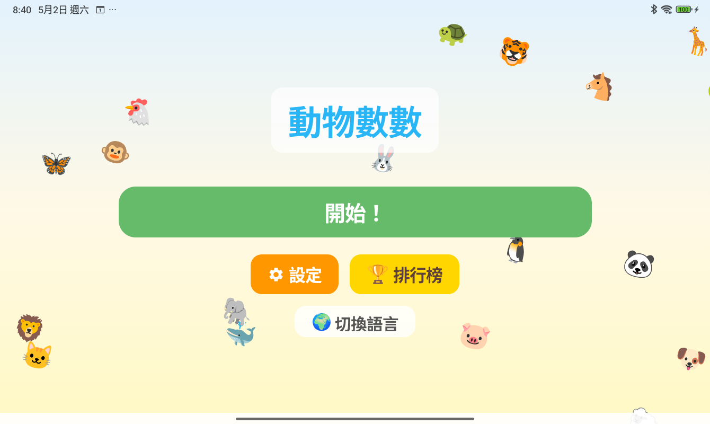 | 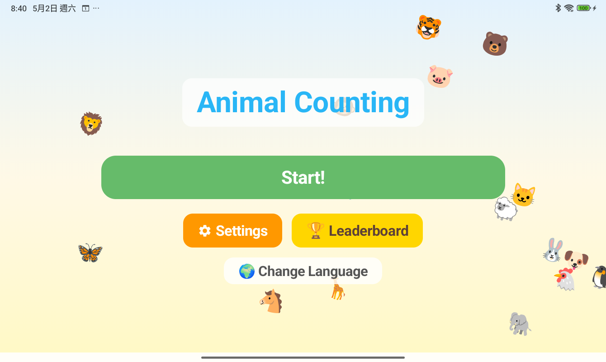 | 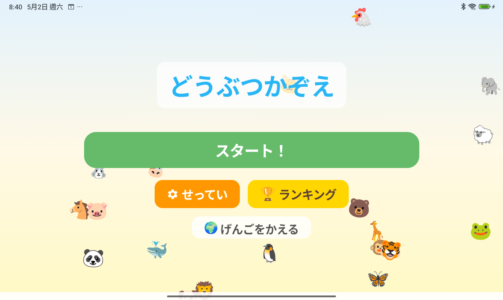 |

20 隻動物在畫面上活潑地跳來跳去 🎉
按「**開始！**」就可以開始玩囉！

---

### 🎯 遊戲畫面 Game Screen

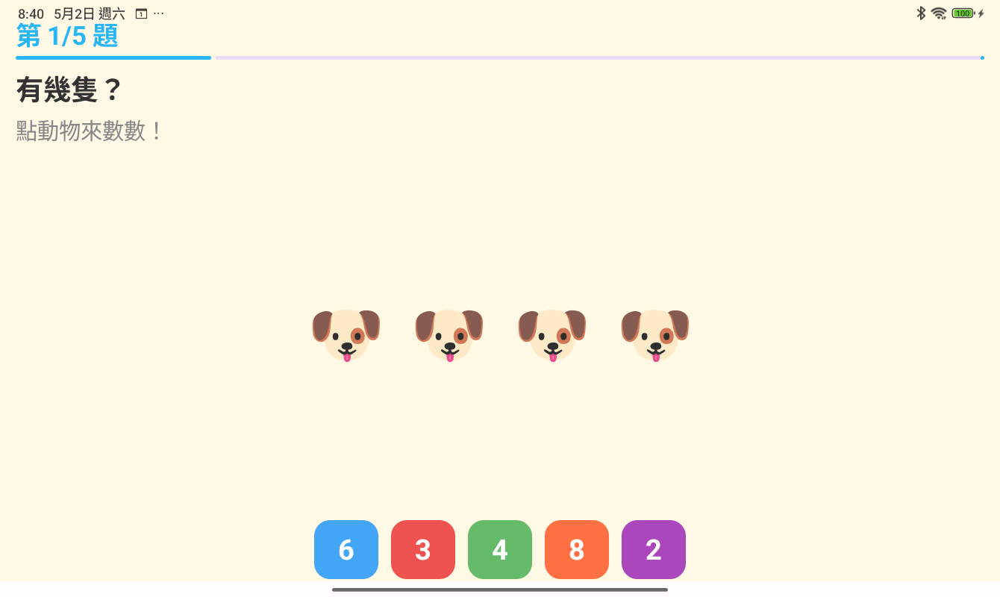

- 畫面中間會出現一群動物
- 可以**點動物**來一隻一隻數（點過的動物會出現藍色圓圈 🔵）
- 數好之後，按下面**正確的數字**！

---

### ⭐ 答對了！ Correct!

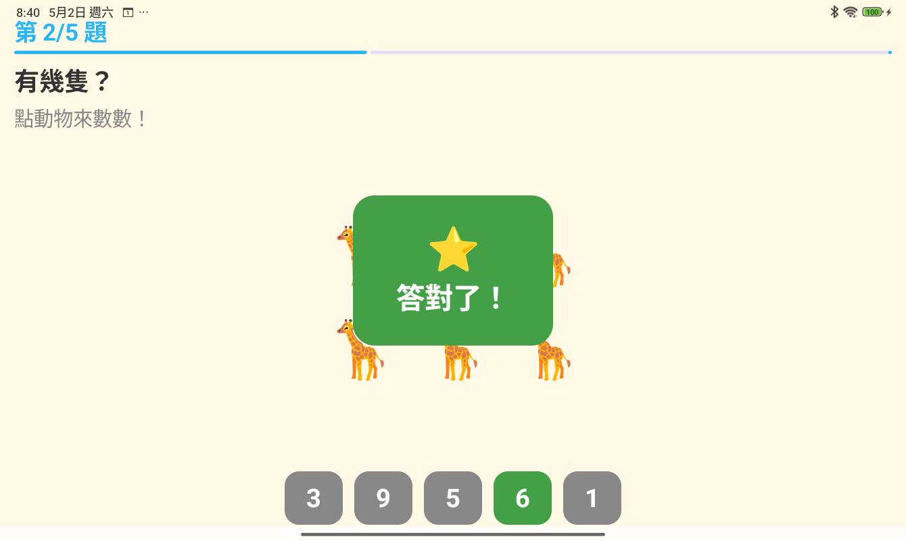

答對會出現**綠色大方塊**和 ⭐ 星星，同時唸出「答對了！」

---

### 😢 不對哦！ Wrong!

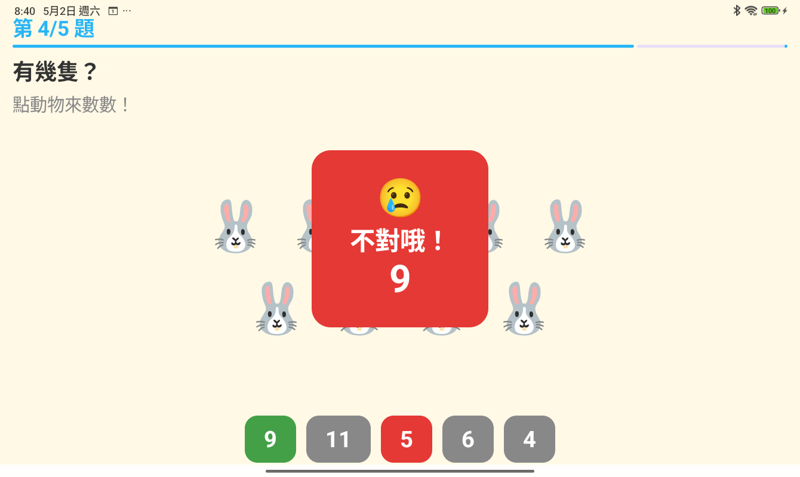

答錯會出現**紅色大方塊**，並顯示正確答案，讓小朋友知道應該是幾隻！

---

### 🔵 點動物數數 Tap to Count

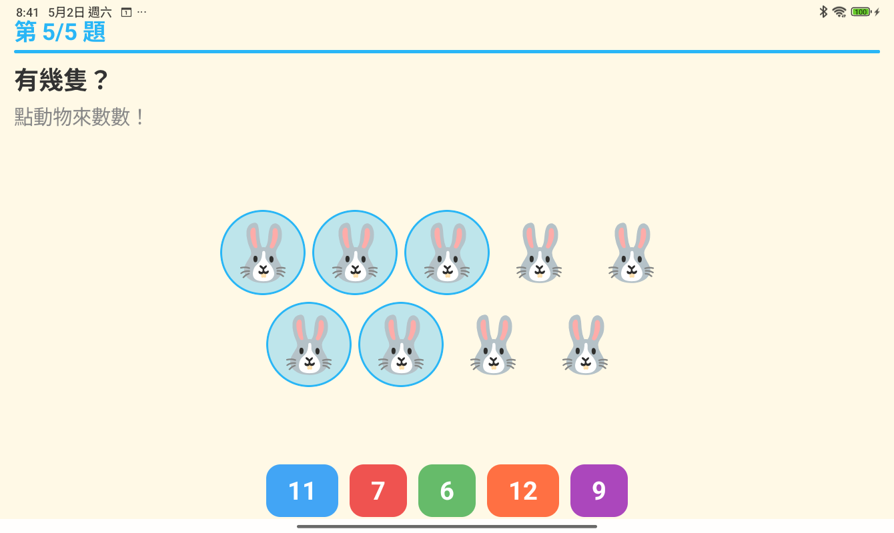

點過的動物會用藍色圈圈標記，方便小朋友追蹤自己數到哪裡了！

---

### 🏆 成績畫面 Result Screen

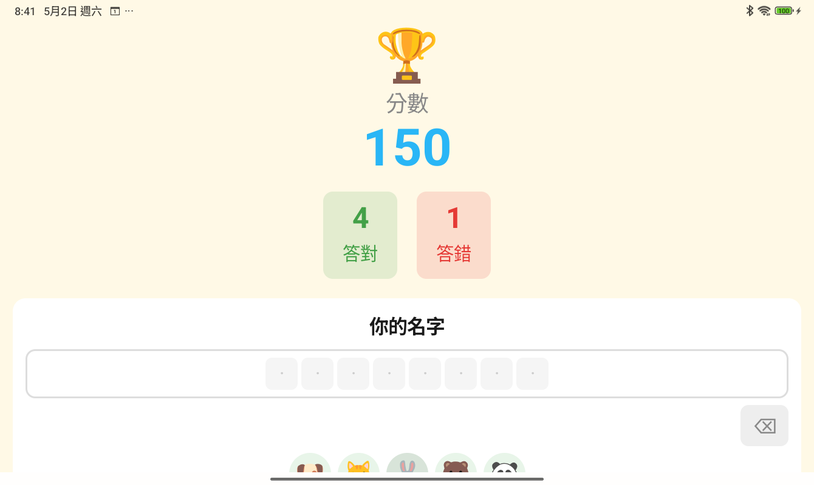

遊戲結束後可以看到：
- 🏆 **分數**（答對越多、答錯越少，分數越高！）
- ✅ **答對幾題** / ❌ **答錯幾題**
- 用**動物 emoji** 輸入你的名字（最多 8 隻，可以重複！）

---

### 🏆 排行榜 Leaderboard

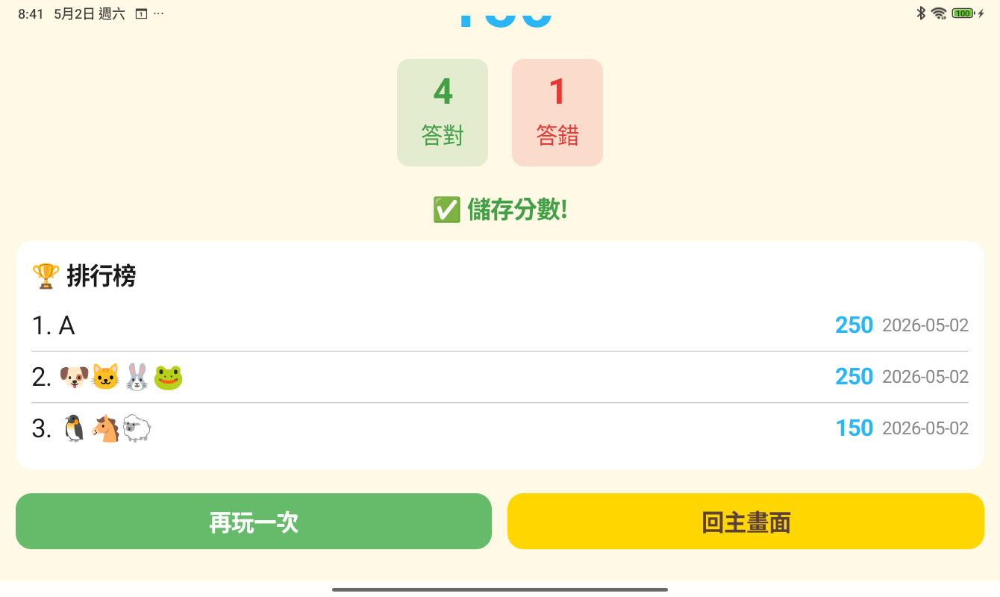

記錄最厲害的前 10 名小朋友，名字用動物 emoji 顯示，超可愛！ 🐶🐱🐰🐸

---

### ⚙️ 設定畫面 Settings

| 設定上半部 | 設定下半部 |
|-----------|-----------|
| 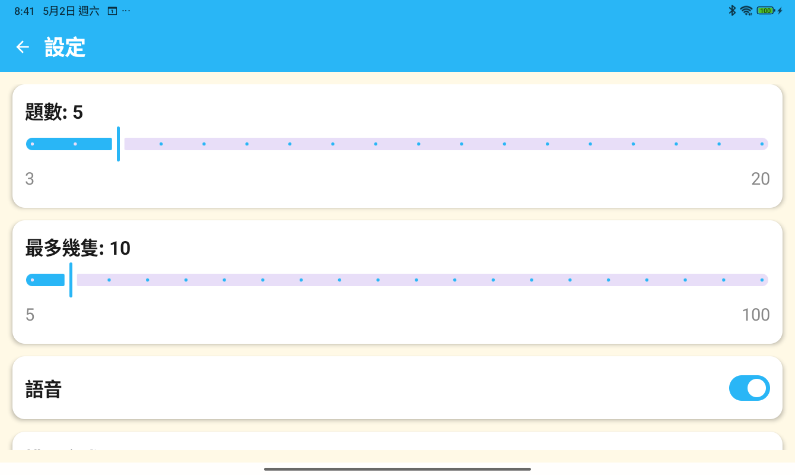 | 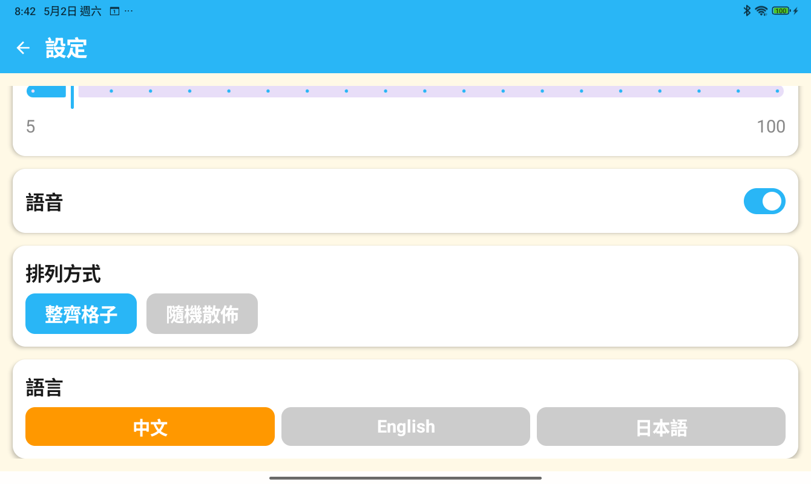 |

爸爸媽媽可以幫小朋友調整：

| 設定 | 說明 | 範圍 |
|------|------|------|
| 📝 題數 | 每次玩幾題 | 3 ~ 20 題 |
| 🐾 最多幾隻 | 最多出現幾隻動物 | 5 ~ 100 隻 |
| 🔊 語音 | 開/關 數字朗讀 | — |
| 📐 排列方式 | 整齊格子 或 隨機散佈 | — |
| 🌍 語言 | 中文 / English / 日本語 | — |

---

## 🌟 特色功能 Features

- 🐾 **20 種可愛動物** — 狗🐶 貓🐱 兔🐰 熊🐻 熊貓🐼 豬🐷 牛🐮 青蛙🐸 猴🐵 獅子🦁 老虎🐯 雞🐔 企鵝🐧 鯨魚🐳 大象🐘 長頸鹿🦒 羊🐑 馬🐴 蝴蝶🦋 烏龜🐢
- 🌍 **三種語言** — 中文、English、日本語，介面＋語音一起切換
- 🔊 **語音朗讀** — 點動物時唸數字、按答案先唸選的數字再唸對錯
- 📏 **自動縮放** — 不管幾隻動物，都會剛好填滿畫面、置中顯示
- 🎨 **可愛配色** — 明亮活潑的兒童專屬配色
- 👨‍👩‍👧 **多人共用** — 用動物 emoji 區分不同小朋友的名字，一台手機全家都能玩

---

## 🚀 如何安裝 How to Install

### 方法一：直接下載 APK（推薦給家長）
1. 前往 [Releases](../../releases) 頁面
2. 下載最新的 `app-debug.apk`
3. 在 Android 手機上安裝（需開啟「允許未知來源」）

### 方法二：自己編譯 Build from Source
需要：Android Studio、JDK 17+

```bash
git clone https://github.com/YOUR_USERNAME/CountNumberZoo_Android.git
cd CountNumberZoo_Android
./gradlew assembleDebug
# APK 在 app/build/outputs/apk/debug/app-debug.apk
```

**系統需求：** Android 12 以上（API 31+）

---

## 👨‍👩‍👧 給家長的說明 For Parents

- 完全**免費**、**無廣告**、**無任何內購**
- **不需要**網路連線
- **不蒐集**任何個人資料
- 排行榜資料只存在手機本機，不會上傳
- 適合 **1–6 歲**幼兒，字體大、按鈕大、操作簡單

---

## 🛠️ 開發資訊 Technical Info

| 項目 | 內容 |
|------|------|
| 語言 | Kotlin |
| UI | Jetpack Compose + Material3 |
| 最低 Android 版本 | Android 12 (API 31) |
| 語音 | Android 內建 TextToSpeech |
| 資料儲存 | DataStore Preferences |
| 授權 | MIT License |

---

## 📄 授權 License

```
MIT License — 免費使用、修改、散佈，請保留版權聲明。
```

詳見 [LICENSE](LICENSE) 檔案。

---

## 🤝 貢獻 Contributing

歡迎提交 Issue 或 Pull Request！
如果你的小朋友玩了覺得有趣，也歡迎給個 ⭐ Star！

---

*用 ❤️ 為小朋友打造 ｜ Made with ❤️ for kids*
